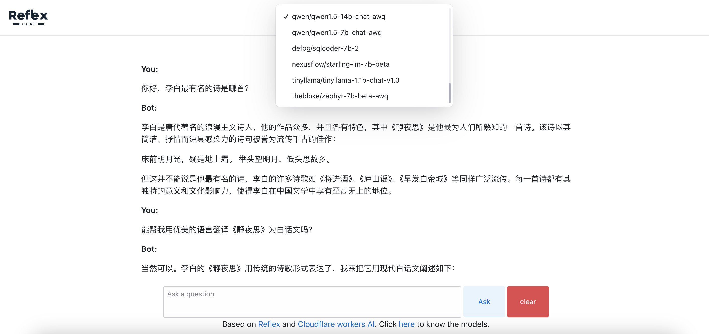

# reflexChat
 ChatAI app build on Reflex and Cloudflare workers AI

## How to run locally

1. Clone the repo

```bash
git clone https://github.com/panxiaoguang/reflexChat.git
```

2. Install dependencies

```bash
python3 -m venv .venv
source .venv/bin/activate
cd reflexChat
pip install -r requirements.txt
```

3. Run the app

```bash
reflex init
reflex run
```

4. Open the browser and navigate to `http://localhost:3000`

## Feature:
- Support all text generation models in Cloudlfare workers AI
- Support stream generation
- start and stop
- new conversation
- chat memories(context)
- Not support mobile display ( I can do that because too naive)


## demo

https://reflexchat.reflex.run/

## screenshot

